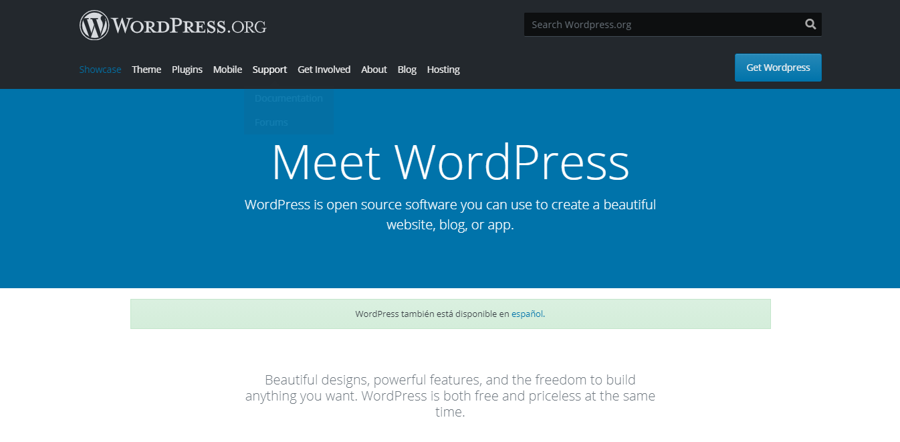

# Clon de WordPress (Home)

_Practica de clone de wordpress (home) 
* https://clonwordpress.netlify.app/

## Comenzando 🚀

### Pre-requisitos 📋

_Navegador Web

```
Como: Chroome, Brave entre otros
```

### Instalación 🔧

_Descargar el proyecto o clonarlo por medio de git 


## Construido con 🛠️

_Herramientas para crear el proyecto_


* [Bootstrap](https://getbootstrap.com/) - framework front-end utilizado
* [Css](https://developer.mozilla.org/es/docs/Web/CSS) - Estilos 
* [html5](https://developer.mozilla.org/es/docs/HTML/HTML5) - usado para estructurar y presentar el contenido para la web
* [SASS](https://sass-lang.com/) -  preprocesador CSS Sass
📖

## Autor ✒️


* **Eduardo Mejia** - *Trabajo Inicial* - [Mejia] (https://github.com/eduardo7mejia)


## Licencia 📄

Este proyecto está bajo la Licencia (MejiaApp) - mira el archivo [LICENSE.md](LICENSE.md) para detalles


---
Hecho con ❤️ por [Mejia](https://github.com/eduardo7mejia)😊


